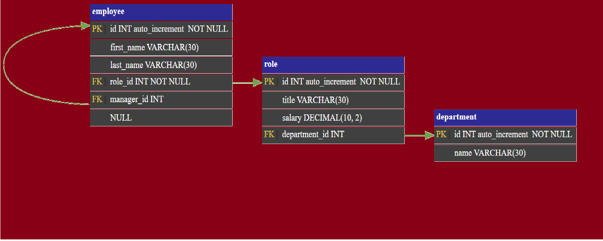

# Quiz Challenge

## Table of Contents

 - [Description](#description)
 - [How to Launch the App](#how-to-launch-the-app)
 - [User Story](#user-story)
 - [Acceptance Criteria](#acceptance-criteria)
 - [Project Structure Overview](#project-structure-overview)
 - [Images](#images)
 - [Database Schema](#database-schema)
 - [Video Clip](#video-clip)
 - [Link To Recorded Video](#link-to-recorded-video)
 - [Link to GitHub Pages ](#link-to-gethub-website)
 - [Node Packages Used](#node-packages-used)
 - [Skills Used](#skills-used)

 ## Description
The main goal of this application is to use the skills we learned in class to create a coding quiz.

 Code quiz is the 12th challenge for the Ohio State coding bootcamp.
-	My motivation for this project was to become proficient at coding SQL, Node.js, Inquirer, and MySQL.  
-	Building this project allowed me to implement coding techniques that I have been studying halfway through this bootcamp. 
-	This was a great example of real world examples with no start code.  
-	I learned how to code and deploy backend interfaces. 

## How To Launch the app
To launch this app you want to make sure that Express is already installed. Additionally you will ned to SOURCE the two .sql files in the "db" folder.
- 1. Install Express
- 2. Get into MYSQL terminal and SOURCE the two .sql files in the "db" folder again.
- 3. To run the application type "NODE index.js" in the terminal. 

 ## User Story
- AS A business owner
- I WANT to be able to view and manage the departments, roles, and employees in my company
- SO THAT I can organize and plan my business 

 ## Acceptance Criteria
- GIVEN a command-line application that accepts user input
- WHEN I start the application
- THEN I am presented with the following options: view all departments, view all roles, view all employees, add a department, add a role, add an employee, and       update an employee role
- WHEN I choose to view all departments
- THEN I am presented with a formatted table showing department names and department ids
- WHEN I choose to view all roles
- THEN I am presented with the job title, role id, the department that role belongs to, and the salary for that role
- WHEN I choose to view all employees
- THEN I am presented with a formatted table showing employee data, including employee ids, first names, last names, job titles, departments, salaries, and managers that the employees report to
- WHEN I choose to add a department
- THEN I am prompted to enter the name of the department and that department is added to the database
- WHEN I choose to add a role
- THEN I am prompted to enter the name, salary, and department for the role and that role is added to the database
- WHEN I choose to add an employee
- THEN I am prompted to enter the employee’s first name, last name, role, and manager, and that employee is added to the database
- WHEN I choose to update an employee role
- THEN I am prompted to select an employee to update and their new role and this information is updated in the database

 ## Project Structure Overview
* Database Initialization Files (db folder)
    - content_db_setup.sql: Script to create database schema and tables.
    - seed.sql: Contains seed data for database tables, used for testing purposes.
* JavaScript Library Files (lib folder)
    - Menu.js: Contains the JSON object for main menu command choices.
    - inquirer.js: Defines the InquirerFunctions class which aids in creating inquirer prompt objects. It manages multiple instances based on SQL query   results, using parameters like type, name, message, and choices.
    - questions.js: Stores all the questions utilized in inquirer prompts.
    - connection.js: Handles the creation of connections to the MySQL database.
    - SQL_queries.js: Implements the SQLqueries class for managing repetitive SQL queries to streamline the operations in index.js. Parameters include query and values.
* Public Assets (Public folder)
    - Assets Folder
    - Images Folder
    - main_menu.png: Image used in the README documentation.
* Main Application Script
	- index.js: Core script file containing the bulk of functionality and business logic

 ## Images

 ## Database Schema
 
 
 ## Video Clip
 
 
 ## Link to Recorded Video
https://drive.google.com/file/d/1U9NW4LbY8mvsE3JsF5zCaFojtSNn63JB/view
 
 ## Link to GetHub Website
 https://github.com/harveyzr/Content-Managment-Systems

 ## Node Packages Used
* NPM Node
* NPM mysql
* NPM inquirer
* NPM figlet
* NPM asTable

 ## Skills Used
- Node.js
- Inquirer
- MySQL

